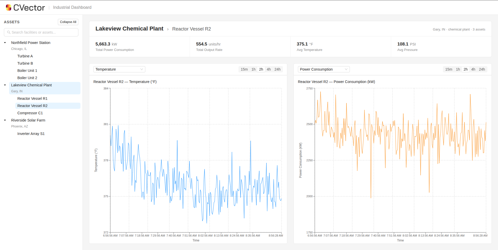

# CVector Industrial Dashboard

A plant monitoring dashboard built with **React + Ant Design**, **FastAPI**, and **PostgreSQL**.



## Quick Start

Prerequisites: [Docker](https://docs.docker.com/get-docker/) and Docker Compose.

```bash
git clone <repo-url>
cd cvector_industrial_dashboard
docker compose up --build
```

Open http://localhost:3000 to view the dashboard.

This starts four services:
- **PostgreSQL** on port 5432 — schema auto-created on first run
- **Live data generator** — seeds 24 hours of historical sensor data, then continuously inserts new readings every 30 seconds
- **FastAPI backend** on http://localhost:8000 — API docs available at http://localhost:8000/docs
- **React frontend** on http://localhost:3000 — auto-polls the backend every 10 seconds

## Stopping

```bash
docker compose down
```

To fully reset the database and start fresh:

```bash
docker compose down -v
docker compose up --build
```

## Adding Facilities, Assets, and Metrics

All data definitions live in `backend/db/seed.py`. No frontend or backend code changes are needed.

**Add a facility** — add an entry to `FACILITIES`:
```python
{"name": "Eastside Manufacturing", "location": "Detroit, MI", "type": "manufacturing"}
```

**Add assets** — add entries to `ASSETS_BY_FACILITY` under the facility name:
```python
"Eastside Manufacturing": [
    {"name": "Press A", "type": "press"},
],
```

**Define an asset type's metrics** — add to `ASSET_METRIC_CONFIG`:
```python
"press": [
    {"metric": "vibration", "unit": "mm/s", "base": 4.5, "variance": 2, "volatility": 0.5},
    {"metric": "power_consumption", "unit": "kW", "base": 600, "variance": 100, "volatility": 0.7},
],w
```

**Add a new metric type** — just use a new `metric` name in the config above. Optionally add a display label and color in `frontend/src/config/metrics.ts`:
```ts
vibration: { label: "Vibration", color: "#eb2f96" },
```

Unknown metrics fall back to auto-formatted labels and a default color, so this step is optional.

After changes, reseed: `docker compose down -v && docker compose up --build -d`

## Architecture

```
Facility (1) → (many) Assets (1) → (many) Sensor Readings
```

- **Database**: PostgreSQL with three tables — `facilities`, `assets`, `sensor_readings`
- **Backend**: Python FastAPI with SQLAlchemy ORM, serving REST endpoints with filtering by facility, asset, metric, and time range
- **Frontend**: React + TypeScript + Vite + Ant Design + Recharts, with auto-polling and localStorage persistence

## API Endpoints

| Method | Endpoint | Description |
|--------|----------|-------------|
| GET | `/api/facilities` | List all facilities |
| GET | `/api/facilities/:id` | Facility details with assets |
| GET | `/api/assets?facility_id=` | List assets, filterable by facility |
| GET | `/api/readings?facility_id=&asset_id=&metric_name=&start_time=&end_time=` | Sensor readings with filters |
| GET | `/api/readings/metrics/:asset_id` | List available metric names for an asset |
| GET | `/api/dashboard/summary/:facility_id` | Aggregated latest metrics for a facility |

## Tech Stack

- **Frontend**: React, TypeScript, Vite, Ant Design, Recharts
- **Backend**: Python, FastAPI, SQLAlchemy
- **Database**: PostgreSQL
- **Infrastructure**: Docker Compose
