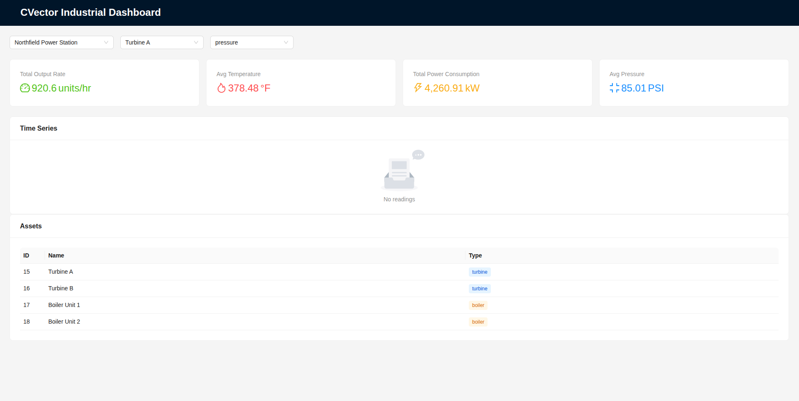
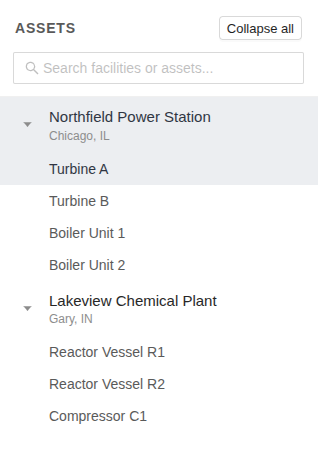

# CVector Industrial Dashboard

## Initial Thoughts

### Requirements

Database Schema
* Database schema for facilities, assets, and sensor readings
* Sensor readings should be timestamped and queryable by time range, facility, asset, and metric name
* Include migration/init script to init the schema
* Generate and seed sample data or create a process that does this

Backend API
* REST or GraphQL API that serves:
    - Facility details including assets
    - Sensor readings with filtering by facility, asset, metric name, and time range
    - A dashboard summary metric that includes latest values for each metric, aggregated across the facility (total power consumption, total output rate)
* Use Python or TypeScript (FastAPI)

React Dashboard
* Build a single-page dashboard that displays:
    - Current plant status: key metrics displayed prominently (total power ... summary)
    - At least one time series chart showing how a metric changes over time (a chart of power consumption over the last 2 hours)
    - Data refreshing automatically without page reload (polling is fine)
* Use any React charting library (Recharts, Chart.js, Victory, D3)

### Thoughts

* Definitely use a relational DB, probably Postgres because of popularity, maybe DuckDB for familiarity
* Ant Design is the recommended React framework, use that
* PostgreSQL database and python FastAPI to create REST endpoints, containerized in docker container with initialization/setup scripts
* React frontend with Vite, Ant Design for UI components
* **Still need to think about auto-refresh (are we polling?) and seed data strategy**

## Clarifying Thoughts with AI

Q: Do we need Next.js?

We do not necessarily, Vite is recommended. Next.js has a lot of features like built-in page routing, SSR & SSG (good for speed), but these are unnecessary for out single-page, internal dashboard

Q: Help me understand what the data might look like.

```
 FACILITIES         
    id  name                       location      type                                                                                                                                                                                                
    1  Northfield Power Station   Chicago, IL    power_station                                                                                                                                        
    2  Lakeview Chemical Plant     Gary, IN       chemical_plant                                                                                                                                        
                                                                                                                                                                                                        
  ASSETS                                                                                                                                                                                                
    id  facility  name                type                                                                                                                                                              
    1   1         Turbine A           turbine                                                                                                                                                           
    2   1         Turbine B           turbine
    3   1         Boiler Unit 1       boiler                                                                                                                                                            
    4   2         Reactor Vessel R1   reactor                                                                                                                                                           
    5   2         Compressor C1       compressor
                                                                                                                                                                                                        
  SENSOR READINGS (sample from Facility 1)                                                                                                                                                              
    asset  metric              value    unit      timestamp
    1      temperature         342.5    °F        14:30:00                                                                                                                                              
    1      power_consumption   1200.0   kW        14:30:00                                                                                                                                              
    1      output_rate         450.0    units/hr  14:30:00
    1      temperature         344.1    °F        14:30:30  ← same asset, 30s later                                                                                                                     
    1      power_consumption   1215.3   kW        14:30:30                                                                                                                                              
    2      temperature         338.9    °F        14:30:00                                                                                                                                              
    2      power_consumption   1150.0   kW        14:30:00                                                                                                                                              
    3      pressure            85.3     PSI       14:30:00        
    3      temperature         421.0    °F        14:30:00                                                                                                                                              
    3      power_consumption   890.0    kW        14:30:00                                                                                                                                              
   
  DASHBOARD SUMMARY (Facility 1 @ 14:30:00)                                                                                                                                                             
    Total power consumption:  1200 + 1150 + 890 = 3240 kW         
    Total output rate:        450 + 410 = 860 units/hr                                                                                                                                                  
    Avg temperature:          (342.5 + 338.9 + 421.0) / 3 = 367.5 °F
    Avg pressure:             85.3 PSI (only boiler reports this)
```

Q: Should each sensor reading metric (power, output) have its own table?

Unnecessary: you can still filter by metric type, and it's easier to add new metric types this way rather than migrating the DB and creating a new table

## Gameplan & Folder Structure

### Folder Structure
```
cvector_industrial_dashboard/
├── docker-compose.yml
├── README.md
├── DEVELOPMENT_HISTORY.md
│
├── backend/
│   ├── Dockerfile
│   ├── requirements.txt
│   ├── app/
│   │   ├── main.py             # FastAPI app, CORS, startup
│   │   ├── database.py         # DB connection/session
│   │   ├── models.py           # SQLAlchemy table definitions
│   │   ├── schemas.py          # Pydantic response models
│   │   └── routes/
│   │       ├── facilities.py
│   │       ├── assets.py
│   │       ├── readings.py
│   │       └── dashboard.py
│   └── db/
│       ├── init.sql            # CREATE TABLEs
│       └── seed.py             # generate sample data
│
├── frontend/
│   ├── Dockerfile
│   ├── package.json
│   └── src/
│       ├── App.tsx
│       ├── api/                # fetch helpers
│       ├── components/
│       │   ├── SummaryCards.tsx
│       │   ├── TimeSeriesChart.tsx
│       │   ├── AssetTable.tsx
│       │   └── Filters.tsx
│       └── hooks/              # usePolling, useDashboardData, etc.
```

## Frontend UI Design

* Left sidebar with dropdowns for facility, asset. Button for summary stats somewhere ... or maybe have them always in view.
* One graph: pick which assets are plotted
* Maybe keep summary stats constantly in view with some area to display 'warnings' ... progrommatically defined warnings based on metric values, movement, time of day etc.
* Feature to decide timeframe [ 15 min | 1h | 2h | 8h | 24h | 1 weekok]

## UX - Start to Finish

The initial snapshot had a few problems. The first was an error that caused the entire app to crash and for the page to just appear white.

TypeScript is compiled into JavaScript at compile time. Interface objects are "interfaces for the developer"; they are useful for readable/writeable code but end up being compiled into JavaScript at compile time. We imported them as objects not types, causing JavaScript to crash during initialization (and therefore never being mounted into React and causing the page to be empty).

Other than that it ran well, although the UI is ugly and certainly needs to be improved.



The original UI has 4 components: Filters (facility/asset/metric selection), SummaryCards (summaries for a single facility), TimeSeriesChart (line chart of metric readings), and AssetTable (list of assets in the facility). This is a solid start but might need to be reconsidered.

First of all, Filters is a good component to have but I want it implemented as a scrollable left sidebar with a drilldown-ui ... more similar to a folder structure on the left sidebar like the one you see in VSCode. This should be easier to see and navigate.

The idea is that everyting is clickable and you don't need to scroll through 3 dropdowns to select what you want to see. We'll keep metrics out of the filters because the workflow will be more like: select an asset, and then from there you can decide what you want to view within that asset. I also may want to add later features for putting multiple metrics on the same graph (rather than only being able to select one).



This feels much more usable (Filters component is now Sidebar).

I've gone ahead and added altered the SummaryCards component to have it reveal more information; it now also lets the user know which facility we're looking at and how many assets that facility has.

I've also completely removed the AssetTable component which I didn't find served any important purpose.

Added the ability to select multiple metrics at once and navigating them by scrolling down across different graphs in the graph view section.

Considering adding a "Warning/Critical Log" right sidebar where users could see a log of warnings detected by our backend (this would also involve more backend processing ... but should be minimal and feels like a real workflow). But I'll hold off on this for now ... it might be too heavy of a feature to include without it being a requirement.

Making the refresh cleaner: create blank slate of cards before the data loads. Added persistant memory (using local browser storage) so that previously selected assets and options stay selected on refresh.

We've created a new API endpoint for seeing which metrics exist for a certain asset: this way we only show buttons for metrics that actually have available data (or have had available data at some point).

## Seeding Strategy

The final thing to do is ensure a good seeding strategy for the sake of throughly testing our system.

Right now the seeding strategy just inserts into the DB. Let's make it live. We now seed 24 hours of previous data and then continuously add data to the DB every 30 seconds.

New facilities are added 

## Final Result


